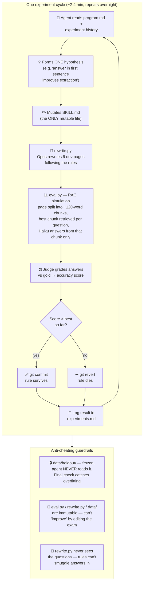

# Self-Improving AEO Skill

An autonomous experiment loop that teaches itself how to rewrite web pages for **Answer Engine Optimization (AEO)** — making content easy for LLMs to extract accurate answers from.

Inspired by [karpathy/autoresearch](https://github.com/karpathy/autoresearch): give an AI agent one mutable file, a hard metric, and a keep/discard rule — then let it experiment overnight.

## How it works



The metric is hard, cheap, and realistic: answer engines don't read your whole page — they retrieve a fragment and answer from it. So the eval splits each page into ~120-word chunks, retrieves the best-matching chunk per question, and has a small model answer **from that chunk alone**. If a fact is buried mid-ramble, separated from its subject, or sitting under an unrelated heading, retrieval misses it — exactly the failure AEO rewriting must fix. The loop discovers *which* rewrite rules actually move this metric, with evidence, not opinions.

Verified starting point: original pages score **66.7%**; the v0 rules already lift it to **72.9%**.

## Files

| File | Role | Mutable by agent? |
|---|---|---|
| `SKILL.md` | The AEO rewrite rules being evolved | ✅ ONLY this |
| `program.md` | Loop instructions (what to mutate, keep/revert criteria) | Human only |
| `rewrite.py` | Applies SKILL.md to pages via Claude API | ❌ Fixed |
| `eval.py` | QA-based grader (Haiku reads page → answers → scored) | ❌ Fixed |
| `data/dev/` | 6 pages + questions the loop iterates on | ❌ Fixed |
| `data/holdout/` | 3 frozen pages — agent must NEVER read these | ❌ Fixed |
| `experiments.md` | Experiment log = the loop's memory | Append-only |

## Setup

Requires Python 3.10+ and an Anthropic API key (`ANTHROPIC_API_KEY` or `ant auth login`).

```bash
pip install anthropic       # or use `uv run` — scripts carry inline deps
```

## Run

```bash
# Baseline: score the ORIGINAL (unrewritten) dev pages
python3 eval.py --set dev --source original

# One full cycle by hand
python3 rewrite.py --set dev
python3 eval.py --set dev --source rewritten

# Start the autonomous loop (in Claude Code)
#   "Lee program.md y empieza a experimentar."
```

Final check for overfitting (run ONCE, at the end of a run):

```bash
python3 rewrite.py --set holdout
python3 eval.py --set holdout --source rewritten
```

If dev accuracy improved but holdout didn't, the rules overfit the dev pages.

## Anti-cheating rules

- The agent never reads `data/holdout/` — enforced by `program.md`
- The agent never edits `eval.py`, `rewrite.py`, or anything in `data/` — improving the score by editing the exam is not improving
- `rewrite.py` never sees the questions, so rules can't smuggle answers in
- The rewriter is hard-constrained to preserve facts; invented facts fail the QA grading naturally

## Cost

No GPU. Grading uses Haiku (~$0.07 per eval run); rewriting uses Opus 4.8 by default (~$0.15 per experiment, override with `AEO_REWRITER_MODEL`). An overnight run of ~50–100 experiments lands around $10–25.
