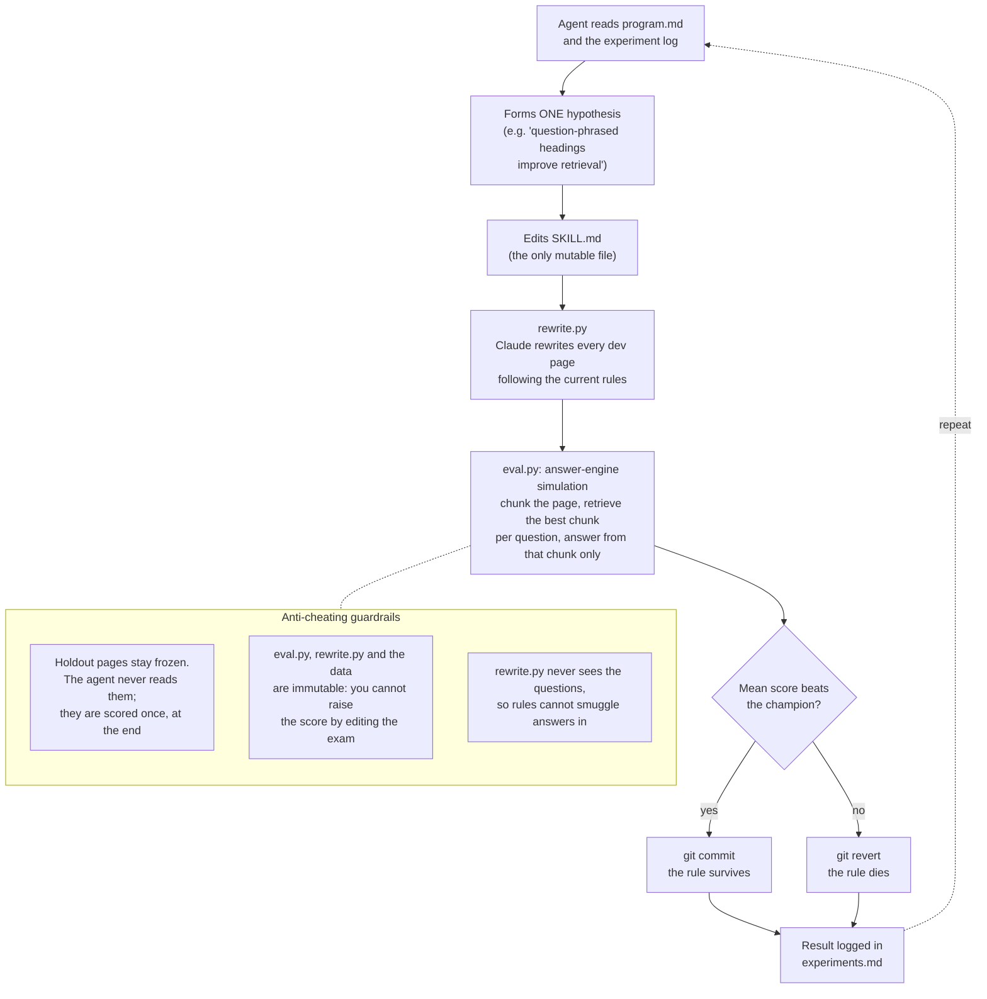

# Self-Improving AEO Skill

An autonomous experiment loop that teaches itself how to rewrite web pages for **Answer Engine Optimization (AEO)**: making content easy for LLMs to extract accurate answers from.

Inspired by [karpathy/autoresearch](https://github.com/karpathy/autoresearch): give an AI agent one mutable file, a hard metric, and a keep/discard rule, then let it experiment overnight.

## How it works



The metric is hard, cheap, and realistic: answer engines do not read your whole page. They retrieve a fragment and answer from it. So the eval splits each page into ~120-word chunks, retrieves the best-matching chunk per question (lexical or embedding retrieval), and has a small model answer **from that chunk alone**. If a fact is buried mid-ramble, separated from its subject, or sitting under an unrelated heading, retrieval misses it. That is exactly the failure AEO rewriting must fix. The loop discovers *which* rewrite rules actually move this metric, with evidence, not opinions.

## Results

| Run | Corpus | Dev (before, after) | Holdout (before, after) |
|---|---|---|---|
| Run 1 (2026-07-05) | 9 synthetic pages in `data/` | 66.7%, 82.8% | 62.5%, 83.3% |
| Run 2 (2026-07-05 to 2026-07-08) | 14 real pages in `data-real/` | lexical 56.9%, 75.5%; embedding 40.3%, 68.1% | lexical +0.8 pts; embedding +7.5 pts |

Run 2 is the honest headline. On real pages (SaaS pricing pages and SEO guides), the loop found one robust rule (one section per plan instead of a cross-plan comparison table), killed two plausible-sounding ideas that lowered the score, and then took the exam that matters: pages it had never seen. Most of the dev-set gain did not transfer; the holdout improved by only +0.8 (lexical) and +7.5 (embedding) points, averaged over 3 rewrite samples. Holdout variance across samples was large (52.5% to 75.0% embedding). Conclusion: single-measurement before/after AEO case studies are statistically meaningless at page scale. Every experiment, keep, and revert is logged in [`experiments.md`](experiments.md).

Note on `data-real/`: the real-page corpus is not committed (copyright); the repo ships a synthetic corpus in `data/` that reproduces the setup. To rerun on your own pages, mirror the `data/` layout and pass `--root your-data`.

## Files

| File | Role | Mutable by agent? |
|---|---|---|
| `SKILL.md` | The AEO rewrite rules being evolved | Yes, only this |
| `program.md` | Loop instructions (what to mutate, keep/revert criteria) | Human only |
| `rewrite.py` | Applies SKILL.md to pages via Claude API | No |
| `eval.py` | QA-based grader (chunk, retrieve, answer, score) | No |
| `data/dev/` | Pages + questions the loop iterates on | No |
| `data/holdout/` | Frozen pages the agent must never read | No |
| `experiments.md` | Experiment log, the loop's memory | Append only |

## Setup

Requires Python 3.10+ and an Anthropic API key (`ANTHROPIC_API_KEY` or `ant auth login`).

```bash
pip install anthropic       # or use `uv run`: scripts carry inline deps
```

## Run

```bash
# Baseline: score the ORIGINAL (unrewritten) dev pages
python3 eval.py --set dev --source original

# One full cycle by hand
python3 rewrite.py --set dev
python3 eval.py --set dev --source rewritten

# Start the autonomous loop (in Claude Code)
#   "Lee program.md y empieza a experimentar."
```

Final check for overfitting (run ONCE, at the end of a run):

```bash
python3 rewrite.py --set holdout
python3 eval.py --set holdout --source rewritten
```

If dev accuracy improved but holdout did not, the rules overfit the dev pages.

## Anti-cheating rules

- The agent never reads `data/holdout/`; enforced by `program.md`
- The agent never edits `eval.py`, `rewrite.py`, or anything in `data/`; improving the score by editing the exam is not improving
- `rewrite.py` never sees the questions, so rules cannot smuggle answers in
- The rewriter is hard-constrained to preserve facts; invented facts fail the QA grading naturally
- Rewrite output varies between samples by several points, so keep/revert decisions gate on the mean of 3 samples, not a single lucky run

## Cost

No GPU. Grading uses Haiku (~$0.07 per eval run); rewriting uses Opus 4.8 by default (~$0.15 per experiment, override with `AEO_REWRITER_MODEL`). An overnight run of 50 to 100 experiments lands around $10 to $25.
